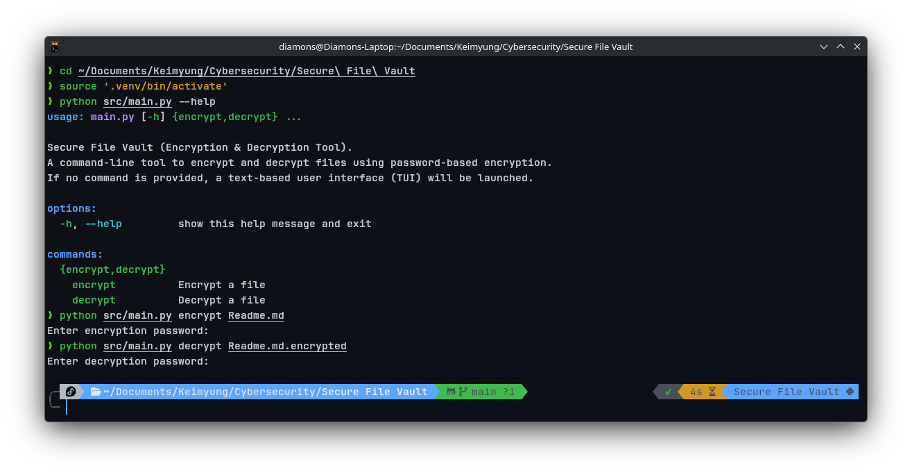
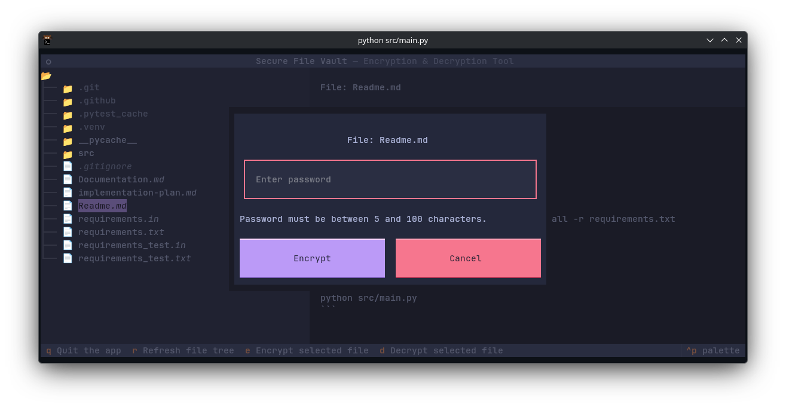

# Contents
- Executive summary
- Technical design and architecture
- Security analysis (threat model, assumptions, limitations)
- Testing methodology and results
- Team member roles and contributions
- References and datasets used
- Quick start / usage

## Executive summary
- Secure File Vault is a small Python tool that provides password-based encryption and decryption of files.
- The implementation uses Argon2id (via `argon2`) as the KDF for deriving a symmetric key from a password and the `cryptography` library's high-level `Fernet` API for authenticated symmetric encryption.
- The project offers both a CLI entrypoint (`Secure File Vault/src/main.py`) which supports `encrypt` and `decrypt` subcommands, and a text-based user interface under `Secure File Vault/src/tui/`.
- Encrypted files use a simple envelope/header format (salt + Argon2 params) stored at the start of the output file; the plaintext file is removed after successful encryption.

### Example CLI usage

### Example TUI usage

## Technical design and architecture

### Project layout (key files)
- `Secure File Vault/src/main.py` — CLI entrypoint and argument parsing. Supports:
  - `encrypt <filepath> [-p|--password]`
  - `decrypt <filepath> [-p|--password]`
  - If no command is supplied, the TUI (`Secure File Vault/src/tui/`) is launched.
- `Secure File Vault/src/utils/encryption.py` — core crypto functionality implemented in the `Encryption` class. Important symbols:
  - `Encryption._derive_key(password, salt)` — derives a Fernet key from a password and a 16-byte salt using Argon2 low-level API.
  - `Encryption.encrypt_file(filepath, password)` — encrypts the file, writes an encrypted file with suffix `.encrypted`, and removes the plaintext file.
  - `Encryption.decrypt_file(filepath, password)` — reads header and encrypted payload, derives the key with stored parameters, attempts decryption, restores plaintext, and removes encrypted file.
  - `Encryption.ENCRYPTED_FILE_SUFFIX` — currently set to `".encrypted"`.
- `Secure File Vault/src/utils/test_encryption.py` — unit tests (pytest) and helper test utilities (monkeypatching Argon2 and replacing the KDF in tests for speed/determinism).
- `Secure File Vault/src/tui/` — TUI components (UI code and styling) used when the program runs without explicit subcommands.

### Envelope / on-disk format
- When encrypting, the output file is created by concatenating:
  - 16-byte random salt (from `os.urandom(16)`)
  - 4-byte little-endian `TIME_COST` (uint32)
  - 4-byte little-endian `MEMORY_COST` (uint32)
  - 4-byte little-endian `PARALLELISM` (uint32)
  - followed by the `Fernet`-produced ciphertext blob.
- The decrypt routine reads the first 16 + 12 bytes to extract salt and Argon2 parameters and then reads the remainder as the ciphertext.

### KDF and cipher choices
- KDF: Argon2id via the low-level API (`argon2.low_level.hash_secret_raw`) with configurable parameters declared as class attributes (`TIME_COST`, `MEMORY_COST`, `PARALLELISM`, `KEY_LENGTH`).
  - Defaults in code: `TIME_COST = 2`, `MEMORY_COST = 1024 * 1024`, `PARALLELISM = 4`, `KEY_LENGTH = 32`.
  - The memory cost constant in the code is set very high intentionally (commented as "1GB") — note this must be tuned to target hardware (see Security section).
- Cipher: high-level `Fernet` from `cryptography` for authenticated symmetric encryption. The derived 32 bytes are base64-url-encoded and used as the Fernet key.

### Operational flows
- Encrypt:
  1. Check file is not already encrypted (`.encrypted` suffix).
  2. Generate 16-byte salt.
  3. Derive key via Argon2 low-level API.
  4. Read file (currently reads entire file into memory), encrypt with `Fernet.encrypt`, write header + ciphertext to `filepath + ".encrypted"`.
  5. Remove original plaintext file.
- Decrypt:
  1. Verify filename suffix.
  2. Read header (16 + 12 bytes) and ciphertext (rest).
  3. Re-derive key with extracted salt and parameters.
  4. Attempt `Fernet.decrypt`; on success, write plaintext to filename with suffix removed and remove the encrypted file. On failure, raise an error and keep the encrypted file intact.

## Security analysis

### Threat model
- Primary assets:
  - Confidentiality and integrity of file contents.
- Adversaries:
  - Local disk attacker (can read ciphertext files).
  - Network eavesdropper (when encrypted files are transferred).
  - Local non-root attacker (may try to inspect process memory or files).
  - Note: full OS compromise (root/kernel compromise, keyloggers, or compromised signer) is out-of-scope.
- Adversary goals:
  - Recover plaintext from ciphertext without valid password.
  - Modify ciphertext so the receiver accepts altered plaintext.

### Assumptions
- Upstream libraries (`argon2`, `cryptography`) are correct and up-to-date.
- The executing environment provides a cryptographically secure RNG (`os.urandom`).
- Users supply sufficiently strong passphrases or use externally-provisioned high-entropy keys.
- The host OS is not fully compromised.

### Controls implemented in code
- Password strengthening: Argon2id KDF (configurable parameters recorded in the file header to permit per-file tuning).
- Authenticated encryption via `Fernet` (ensures tamper detection; decryption fails on tampering).
- Per-file random salt to prevent reuse / precomputation.
- Envelope includes the Argon2 parameters so files can be decrypted even if KDF parameters change later.
- Tests include tamper-detection checks (see tests).

### Limitations and residual risks (explicit)
- KDF parameter defaults: The `MEMORY_COST` in `Secure File Vault/src/utils/encryption.py` is set to a very large value (`1024 * 1024`) which may be impractical on many systems — this must be benchmarked and tuned. Running Argon2 with extremely large memory_cost can be slow or fail on resource-constrained hosts.
- Plaintext file handling:
  - The implementation removes the source plaintext after encryption (`os.remove(filepath)`) — if the encryption write fails after removing the plaintext, data loss is possible. The current code writes encrypted file first and then removes plaintext, but users should ensure backups or test workflows before bulk processing.
  - The implementation reads the entire file into memory before encryption and decryption, so it does not currently stream large files; this may be problematic for very large files (memory exhaustion).
- Secrets in memory:
  - Python does not guarantee secure in-memory zeroization of secrets; derived keys and plaintext may remain in memory or be paged to swap. For very high-security use cases, consider native tools or memory-locking extensions.
- Metadata leakage:
  - Ciphertext length leaks the plaintext size. The header currently contains no filename or timestamp, but the file suffix reveals that the file is encrypted.
- Algorithm details:
  - The project uses `Fernet` as the high-level authenticated encryption primitive from `cryptography`. Do not assume specific cipher internals beyond the guarantees `Fernet` documents (authenticated encryption and versioning).
- Compromised endpoints:
  - If an attacker has keylogging or full filesystem/OS control, they can capture passphrases and decrypted files.

## Testing methodology and results

### Tests included
- `Secure File Vault/src/utils/test_encryption.py` — unit tests using `pytest`. Highlights:
  - Round-trip encryption/decryption test that verifies header structure, encryption, and file replacement behavior.
  - Tests asserting error conditions: encrypting an already-encrypted file, decrypting a non-encrypted file, and decryption with a wrong password.
  - Tests use monkeypatching to replace the expensive Argon2 `PasswordHasher` and to replace `Encryption._derive_key` with a fast deterministic PBKDF2-based function to keep tests deterministic and fast.

### Test strategy
- Unit tests validate:
  - Header layout is present and parsable (16-byte salt + three 4-byte parameters).
  - Correctness of round-trip encrypt/decrypt for small payloads.
  - Correct handling of incorrect passwords (decryption fails and encrypted file is preserved).
- Deterministic test KDF: To avoid heavy resource usage and non-determinism from Argon2, tests monkeypatch the `Encryption._derive_key` method to a deterministic PBKDF2-derived key implementation (see `test_encryption.py`).
- Suggested additions (not yet present in the repository):
  - Integration tests for large files and streamed handling.
  - Fuzz tests for the parsing logic that reads the header and ciphertext.
  - Performance benchmark tests for Argon2 parameter selection.

### How to run tests
- Create and activate the venv as instructed by `Secure File Vault/Readme.md`:
  - `python -m venv .venv`
  - `source .venv/bin/activate`
  - `pip install -r requirements.txt`
- From repo root:
  - `pytest -q`
- The tests currently expect Python 3.9+ (code uses `str.removesuffix` which is available in 3.9+).

### Test results
- The repository includes a test suite designed to validate typical success and failure modes. (I did not run the tests in this environment; please run `pytest` locally or in CI to verify on your target hardware and Python interpreter.)

## Team member roles and contributions

You are the sole author on this project; role mapping (what you implemented):
- Encryption Engineer:
  - Implemented Argon2id-based KDF integration and key derivation in `Secure File Vault/src/utils/encryption.py`.
  - Implemented encrypt and decrypt operations and envelope format.
- UI/UX Designer:
  - Implemented the CLI entrypoint and argument parsing in `Secure File Vault/src/main.py`.
  - Implemented a text-based UI under `Secure File Vault/src/tui/` (TUI subcomponents are provided).
- Security Auditor:
  - Added header parameterization to record KDF parameters per-file.
  - Wrote unit tests for correctness and tamper detection behavior (`Secure File Vault/src/utils/test_encryption.py`).
  - Documented security considerations in project docs (`Secure File Vault/Documentation.md` and this README).

## References and datasets used
- Upstream libraries and docs:
  - `cryptography` — high-level cryptographic primitives and `Fernet` (https://cryptography.io).
  - `argon2-cffi` / `argon2` Python package — Argon2 KDF (https://argon2-cffi.readthedocs.io).
- Standards and guidance:
  - Argon2 specification and PHC (Password Hashing Competition) recommendations.
  - OWASP Cryptographic Storage guidelines (for operational practices and KDF guidance).
- Datasets:
  - No external datasets are used. Tests create local fixtures in `Secure File Vault/src/utils/test_encryption.py` using generated or in-repo data only.

## Quick start / usage (from the repository)
- Install (see `Secure File Vault/Readme.md`):
  - Setup virtualenv and install requirements with `pip install -r requirements.txt`.
- CLI usage (refer to `Secure File Vault/src/main.py`):
  - Encrypt:
    - `python src/main.py encrypt path/to/file [-p "password"]`
    - If `-p` is omitted, the program securely prompts for a password.
  - Decrypt:
    - `python src/main.py decrypt path/to/file.encrypted [-p "password"]`
  - Running without arguments launches the TUI:
    - `python src/main.py` — opens the text UI implemented under `Secure File Vault/src/tui/`.
- Notes:
  - Encrypted files are written as `originalfilename.encrypted` and the original file is removed after successful encryption.
  - Decryption restores the original filename by removing the `.encrypted` suffix.
  - Tests can be run with `pytest`.
